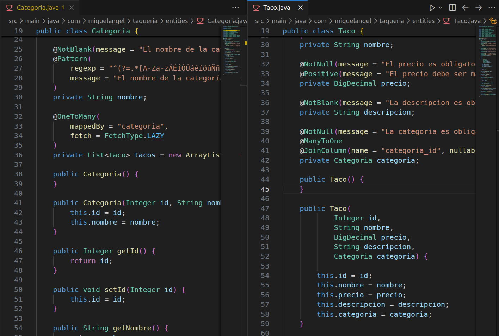
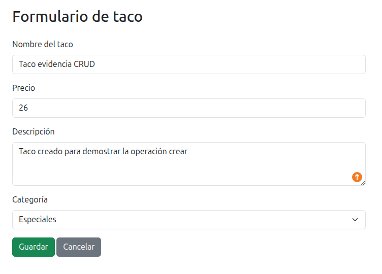
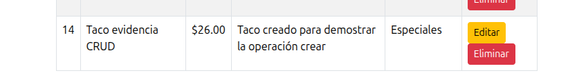
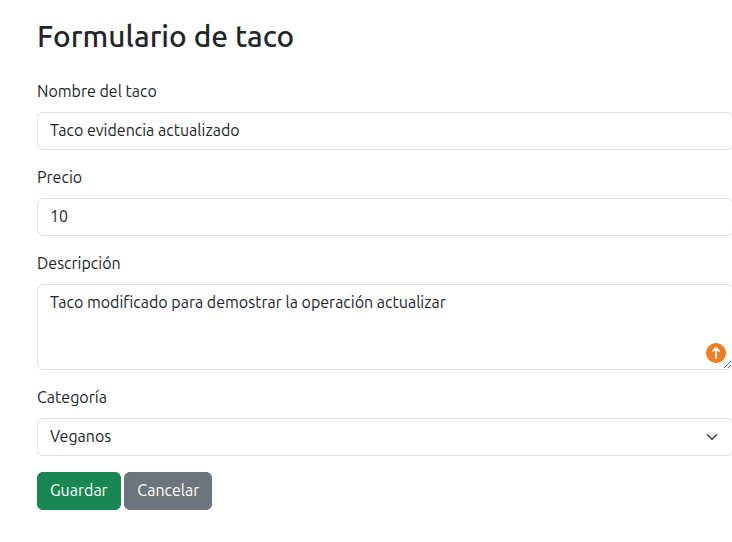
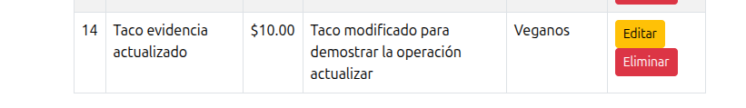
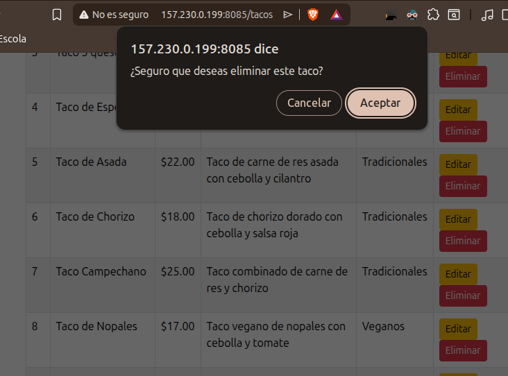
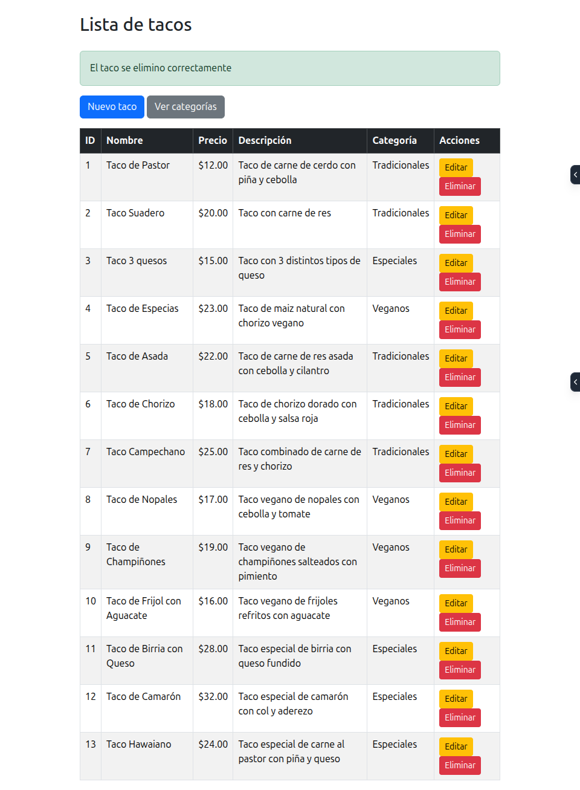
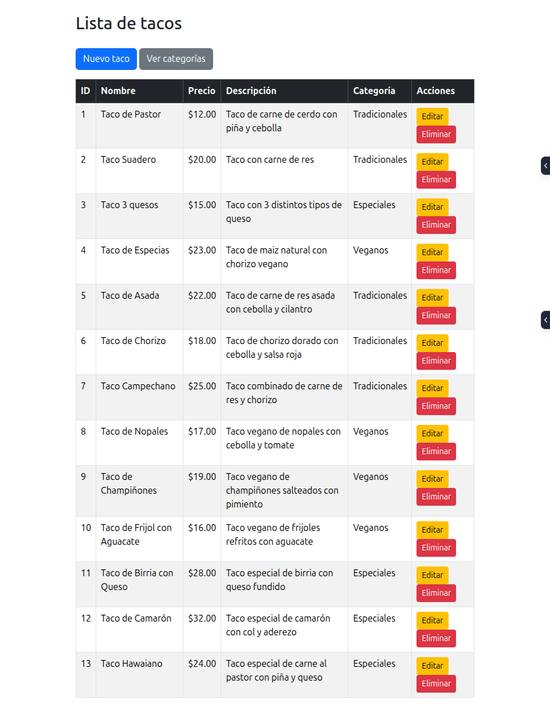
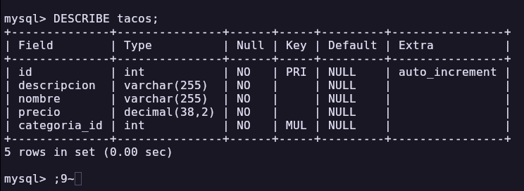
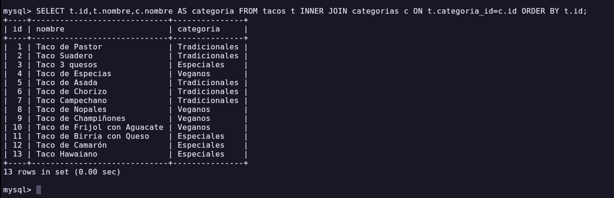

# Actividad 3 - CRUD en Spring Boot y Relaciones

## Datos del alumno

- **Nombre:** Miguel Angel Hernández Pérez
- **Materia:** Programación Web
- **Docente:** Adelina Martínez Nieto
- **Institución:** Instituto Tecnológico de Oaxaca
- **Actividad:** Act3. CRUD en Spring Boot y Relaciones

## Descripción

Este proyecto consiste en un CRUD de taquería desarrollado con Spring Boot, Thymeleaf, Spring Data JPA y MySQL.

Permite registrar, consultar, actualizar y eliminar tacos. Cada taco pertenece a una categoría, por lo que se implementó una relación entre las entidades `Taco` y `Categoria`.

## Tecnologías utilizadas

- Java 21
- Spring Boot 4
- Spring Web
- Spring Data JPA
- Thymeleaf
- MySQL
- Bootstrap
- Maven

## Entidades y relación

Las entidades utilizadas son:

- `Categoria`
- `Taco`

Una categoría puede tener muchos tacos, mientras que cada taco pertenece a una sola categoría.

La relación se implementó mediante:

- `@OneToMany` en `Categoria`
- `@ManyToOne` en `Taco`
- Llave foránea `categoria_id`



## Arquitectura por capas

El proyecto está organizado en las siguientes capas:

- **Controller:** recibe las peticiones y devuelve las vistas.
- **Service:** contiene la lógica de negocio.
- **Repository:** realiza el acceso a los datos mediante JPA.
- **Entity:** representa las tablas de la base de datos.
- **Templates:** contiene las vistas Thymeleaf.

Flujo principal:

`Controller → Service → Repository → MySQL`

## Operaciones CRUD

### Crear

Se puede registrar un taco mediante un formulario y seleccionar su categoría.



### Leer

Los tacos registrados se muestran en una tabla junto con el nombre de su categoría.



### Actualizar

Los datos de un taco pueden modificarse mediante el formulario de edición.





### Eliminar

Los tacos pueden eliminarse desde la tabla principal.





## Relación entre Taco y Categoria

En la lista se muestra el nombre de la categoría asociada a cada taco, no solamente el valor de la llave foránea.



La tabla `tacos` contiene la columna `categoria_id`, utilizada como llave foránea.



También se comprobó la relación mediante una consulta `INNER JOIN`.



## Rutas principales

- **Lista de tacos:** [http://157.230.0.199:8085/tacos](http://157.230.0.199:8085/tacos)
- **Lista de categorías:** [http://157.230.0.199:8085/categorias](http://157.230.0.199:8085/categorias)
- **Nuevo taco:** [http://157.230.0.199:8085/tacos/nuevo](http://157.230.0.199:8085/tacos/nuevo)
- **Nueva categoría:** [http://157.230.0.199:8085/categorias/nueva](http://157.230.0.199:8085/categorias/nueva)

## Base de datos

La aplicación utiliza una base de datos MySQL llamada:

`hpma_act3_taqueria`

Las tablas principales son:

- `categorias`
- `tacos`

## Ejecución local

1. Crear la base de datos MySQL.
2. Configurar `application.properties`.
3. Ejecutar:

```bash
./mvnw spring-boot:run
```

4. Abrir: [http://localhost:8080/tacos](http://localhost:8080/tacos)

## Despliegue

El proyecto fue compilado como archivo `.jar` y desplegado en un VPS con Ubuntu.

Se ejecuta en el puerto: `8085`

El servicio está configurado mediante `systemd` para iniciar automáticamente.

## Repositorio y proyecto desplegado

- **Repositorio:** [https://github.com/Angixs-zz/HPMAact3_t4](https://github.com/Angixs-zz/HPMAact3_t4)
- **Proyecto en el VPS:** [http://157.230.0.199:8085/tacos](http://157.230.0.199:8085/tacos)
